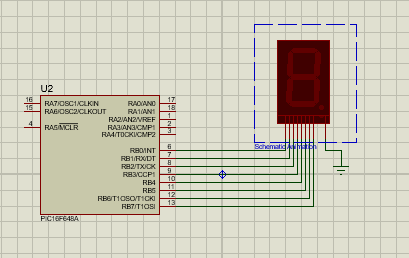

## 
TRABAJO PRACTICO N° 10 - Entrenador Basico

El siguiente archivo "Trabajo Práctico 10 - Entrenador Basico" representa una oportunidad esencial para aplicar los conocimientos teóricos en Electronica Microcontrolda, por medio de la Investigacion de los conceptos y elementos relacionados, para llevarlo a la Practica.

### 
  
       - Docente: Vera Cristian Gonzalo
       - Alumno/a: Huk Romina 

## Desarrollo
### 1. Identificar la palabra de configuración y explicar que representa cada fusible.

- **Protección de Código  (_CP_OFF & _CPD_OFF):** Desactiva la protección que impide leer o escribir en la memoria del programa y de datos, permitiendo cambios y acceso libre a estas áreas.

- **Programación de Bajo Voltaje (_LVP_OFF):** Desactiva el modo de programación que usa voltajes más bajos, asegurando que la programación se realice con voltajes estándar.

- **Detección de Puesta en Marcha (_BODEN_ON):** Activa la función que reinicia el microcontrolador si la tensión de alimentación cae por debajo de un nivel seguro, protegiendo contra fallos por baja tensión.

- **Función del Pin MCLR (_MCLRE_OFF):** Desactiva el pin MCLR como un botón de reinicio externo, permitiendo utilizarlo como un pin de entrada/salida normal.

- **Temporizador de Encendido (_PWRTE_ON):** Habilita un temporizador que introduce un breve retraso al encender el microcontrolador, asegurando que la alimentación sea estable antes de comenzar a ejecutar el código.

- **Temporizador de Vigilancia (_WDTE_OFF):** Desactiva el temporizador que reinicia el microcontrolador si no recibe un reset periódico del software, evitando que quede atrapado en un bucle infinito en caso de fallos.

- **Oscilador Interno sin Salida de Reloj (_INTOSC_OSC_NOCLKOUT):** Utiliza el oscilador interno del microcontrolador como fuente de reloj, pero no proporciona una señal de reloj para uso externo.

### 2. Completar el código provisto en el entrenador básico PIC16f648, de manera que el display haga el conteo de 0 a 9. Se permite utilizar como delay la instrucción nop.

