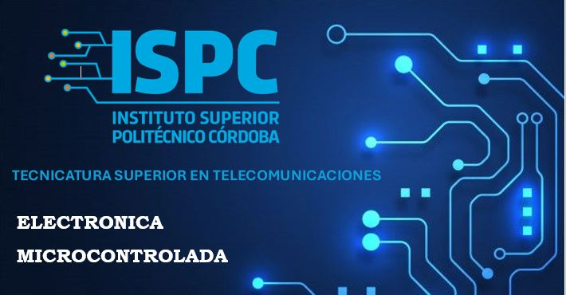

## 
TRABAJO PRACTICO N° 10 - Entrenador Basico

El siguiente archivo "Trabajo Práctico 10 - Entrenador Basico" representa una oportunidad esencial para aplicar los conocimientos teóricos en Electronica Microcontrolda, por medio de la Investigacion de los conceptos y elementos relacionados, para llevarlo a la Practica.

### 
  
       - Docente: Vera Cristian Gonzalo
       - Alumno/a: Huk Romina 

## Objetivos

- Familiarizarse con un entorno de desarrollo de bajo nivel.
- Introducir las primeras practicas con micros PIC de 8 bit
- Introducción a las primeras instrucciones en assembler
- Realizar desarrollos básicos con el PIC16F648

## Organización

- ### A - Requisitos. 
En esta carpeta se encontrara las consignas propuestas por el profesor de la materia Electronica Microcontrolada, donde se detalla, los Objetivos, Fundamentos, Investigacion y organizacion del desarrollo del mismo.

- ### B - Investigacion.
En esta carpeta constara con la investigacion pertinente de cada alumno, a modo de guia para la resolucion del proyecto.

- ### C - Prototipo
En esta carpeta, se desarrollara el proyecto en si, que se presentara en un archivo PFD, el informe que debera incluir, el diseño del circuito, la simulacion en Proteus, los calculos teoricos correspondientes, la comparacion entre los valores teoricos y los resultados de la simulacion, y las conclusiones obtenidas.

Como adicional, cada carpeta estara acompañada por un archivo README, el cual será una descripcion breve de los contenidos de cada carpeta. Tambien se encontrara una carpeta "src" que contendra recursos visuales, imagenes.